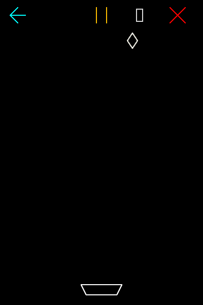

# Catch the Diamonds

A small arcade game in Python and OpenGL where **every pixel is placed by hand**. The catcher, the falling diamonds, the toolbar icons and the score are all drawn with the **midpoint line algorithm**, extended to all eight zones. OpenGL only plots single points. It never draws a line or a polygon itself.

<p align="center">
  
</p>

## Features

- **Midpoint line drawing in all eight zones.** Every shape is built from `GL_POINTS`.
- **Smooth movement.** Hold an arrow key and the catcher moves at 400 px/s, the same speed at any frame rate.
- **Rising difficulty.** Each catch makes the next diamond fall 10 px/s faster, and every diamond gets a random colour.
- **On-screen score.** Seven-segment digits, also drawn with midpoint lines.
- **Clickable toolbar** with restart, pause/resume and quit buttons.
- **Auto-play (cheat) mode.** The catcher works out how fast it has to move to reach each diamond in time.
- **Swept collision check.** Fast diamonds can't pass through the catcher between two frames.

## Controls

| Input | Action |
|---|---|
| Hold `←` / `→` | Move the catcher |
| `P` or `Space` | Pause / resume |
| `R` | Restart |
| `C` | Toggle auto-play (the catcher turns green) |
| `Q` or `Esc` | Quit |
| Mouse click | Toolbar: teal arrow = restart, amber = pause/resume, red cross = quit |

## Getting started

You need Python 3.8 or newer.

```bash
git clone https://github.com/sandipkumarpaul/catch-the-diamonds.git
cd catch-the-diamonds
pip install -r requirements.txt
python catch_the_diamonds.py
```

The game uses **freeglut**:

- **Windows:** the PyOpenGL package from PyPI already includes freeglut, so there's nothing else to install.
- **Linux:** install freeglut first, e.g. `sudo apt install freeglut3-dev` on Debian/Ubuntu.
- **macOS:** untested. The system GLUT doesn't include the freeglut functions the game uses to quit cleanly.

## How it works

### Midpoint line algorithm in eight zones

The basic midpoint algorithm only works in **zone 0**, for lines with a slope between 0 and 1 drawn left to right. `draw_line` handles any line in three steps:

1. **Find the zone.** `find_zone` picks one of the eight octants from the signs of `dx` and `dy` and from whether `|dx| ≥ |dy|`.
2. **Map to zone 0.** `convert_to_zone0` swaps and/or negates both endpoints so the line falls in zone 0.
3. **Draw, then map back.** The algorithm steps one pixel along x at a time. An integer decision variable `d = 2·dy − dx` picks the next pixel: East (`d += 2·dy`) or North-East (`d += 2·(dy − dx)`, `y += 1`). Each pixel goes through `convert_from_zone0` before it is plotted.

| Zone | Condition | To zone 0 | Back from zone 0 |
|:---:|---|:---:|:---:|
| 0 | \|dx\| ≥ \|dy\|, dx ≥ 0, dy ≥ 0 | (x, y) | (x, y) |
| 1 | \|dy\| > \|dx\|, dx ≥ 0, dy ≥ 0 | (y, x) | (y, x) |
| 2 | \|dy\| > \|dx\|, dx < 0, dy ≥ 0 | (y, −x) | (−y, x) |
| 3 | \|dx\| ≥ \|dy\|, dx < 0, dy ≥ 0 | (−x, y) | (−x, y) |
| 4 | \|dx\| ≥ \|dy\|, dx < 0, dy < 0 | (−x, −y) | (−x, −y) |
| 5 | \|dy\| > \|dx\|, dx < 0, dy < 0 | (−y, −x) | (−y, −x) |
| 6 | \|dy\| > \|dx\|, dx ≥ 0, dy < 0 | (−y, x) | (y, −x) |
| 7 | \|dx\| ≥ \|dy\|, dx ≥ 0, dy < 0 | (x, −y) | (x, −y) |

### Game loop

- A GLUT timer fires about 60 times a second. Each tick moves the game forward by the real time that has passed, capped at 0.1 s, so all speeds are in pixels per second.
- Collision is a bounding-box test between the catcher and the whole area the diamond covered during the frame.
- In auto-play, the time to impact is the diamond's height above the catcher divided by its fall speed. The catcher moves at `max(400 px/s, 1.1 × distance / time to impact)`, so it always arrives before the diamond lands.
- If the window is resized, the play area stays at its original 400×600 size in the centre. Stretching it would leave gaps between the plotted points.

## Running the tests

```bash
python -m unittest discover tests
```

The tests replace the OpenGL calls with stubs, so they don't open a window or need a GPU. They check the line algorithm on 3,000 random lines across all eight zones. Each line must have one pixel per step, reach both endpoints, have no gaps, and stay within half a pixel of the true line. They also check the game rules: scoring, speed-up, game over, pause, movement and auto-play.

## Project structure

```
catch-the-diamonds/
├── catch_the_diamonds.py          # the game
├── tests/
│   └── test_catch_the_diamonds.py # headless tests
├── assets/
│   └── demo.png                   # animated gameplay capture (APNG)
├── requirements.txt
├── LICENSE
└── README.md
```

## License

Released under the [MIT License](LICENSE).
